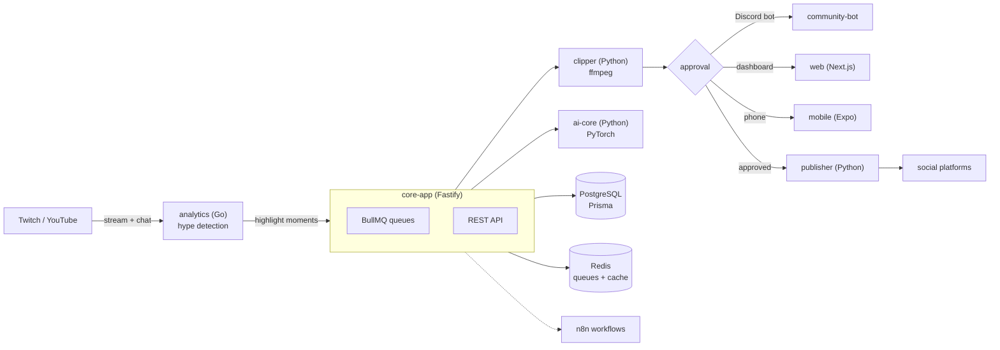

# 🌊 WaveStack

**A self-hostable automation stack for streamers: capture → clip → approve → publish, without gluing together six SaaS tools.** A Fastify core queues the work, a Python service cuts highlights with ffmpeg, a Go service tracks live analytics, and Discord bots plus a Next.js dashboard put approvals where you already are.


## Why this exists

A creator's workflow is a chain of small, boring, repetitive jobs: scrub the VOD, cut the good bit, caption it, resize it per platform, post it, tell the Discord. Each step has a SaaS product with a subscription, and none of them talk to each other. WaveStack is the self-hosted version of that chain: one stack you run yourself, where a clip can go from "chat spiked at 01:12:30" to a queued, approved post without a human doing the busywork.

## What's in the stack

| Piece                                                | Language                             | What it does                                                  |
| ---------------------------------------------------- | ------------------------------------ | ------------------------------------------------------------- |
| `apps/core-app`                                      | TypeScript (Fastify, Prisma, BullMQ) | API and job orchestration, with OpenTelemetry tracing         |
| `apps/web`                                           | Next.js                              | Dashboard: queue, approvals, analytics, live updates over SSE |
| `apps/mobile`                                        | Expo / React Native                  | Approvals on the phone                                        |
| `apps/desktop`                                       | Electron                             | Desktop shell                                                 |
| `services/clipper`                                   | Python (FastAPI + ffmpeg)            | Cuts highlights out of a stream or VOD                        |
| `services/ai-core`                                   | Python (FastAPI + PyTorch)           | Models behind highlight detection and content suggestions     |
| `services/publisher`                                 | Python (FastAPI)                     | Pushes finished clips to platforms                            |
| `services/analytics`                                 | **Go** (Fiber + Redis)               | Live stream analytics and hype detection                      |
| `services/community-bot`                             | TypeScript (discord.js)              | Discord bot: engagement, moderation, clip sharing             |
| `services/notifications`, `services/sponsor-manager` | TypeScript                           | Alerts and sponsorship tracking                               |
| `workflows/n8n-templates`                            | n8n                                  | Drag-and-drop automations for platforms not covered in code   |
| `infra/`                                             | Compose, kustomize, Caddy            | Local stack and Kubernetes manifests                          |

## Architecture



## Getting started

**Requirements:** Docker + Compose. For working on the code: Node 22 with pnpm 9, Python 3.11, Go 1.21+.

### Everything at once (Docker)

```bash
cp .env.example .env
docker compose up -d
```

Brings up Postgres, Redis, core-app, web, clipper, ai-core, publisher, analytics, notifications, the Discord bot and n8n. More detail in [QUICKSTART.md](QUICKSTART.md).

### Working on the code

```bash
pnpm install                                   # workspace: apps/*, services/*, packages/*
pnpm -C apps/core-app exec prisma generate
pnpm -C apps/core-app exec prisma migrate deploy
pnpm dev                                       # core-app in watch mode
```

Checks:

```bash
pnpm typecheck                 # all workspaces
pnpm lint
pnpm -C apps/core-app test     # 47 tests (vitest)
```

Go services:

```bash
cd services/analytics && go build ./... && go test ./...
```

### Kubernetes

```bash
kubectl kustomize infra/k8s/overlays/dev | kubectl apply -f -
```

`infra/k8s` is a kustomize base (23 objects: namespace, config, secrets, infra services, apps, ingress) with `dev` and `prod` overlays. CI renders all three and validates them with `kubeconform -strict` on every push.

## Project status

This is a working stack, not a product. Honest state as of this pass:

- ✅ `pnpm typecheck` clean · `pnpm lint` clean (112 warnings left as visible debt) · core-app tests 47/47
- ✅ Go analytics: `go build`, `go vet` and `go test` all pass (the module used to be unbuildable: bad `go.sum` hashes and imports pointing at a repo that doesn't exist)
- ✅ k8s: base + dev + prod render and pass `kubeconform -strict` (23/23 valid each)
- 🟡 Python services (`clipper`, `ai-core`, `publisher`) ship tests but were not executed in this pass
- 🟡 `_archived/` holds earlier services (agent orchestrator, MCP gateway, knowledge base, stream engine…) kept for reference
- ⚠️ No hosted demo. Self-host it or run the Compose stack locally.

## Docs

[Architecture](docs/ARCHITECTURE.md) · [Codebase map](docs/CODEBASE.md) · [Structure](docs/STRUCTURE.md) · [Local setup](docs/LOCAL-SETUP.md) · [API reference](docs/API-REFERENCE.md) · [Bot integration](docs/BOT-INTEGRATION.md) · [AI personality](docs/AI-PERSONALITY-GUIDE.md) · [Production deploy](docs/PROD-DEPLOY.md) · [Railway](docs/RAILWAY-DEPLOYMENT.md) · [QA](docs/QA.md)

## License

[MIT](LICENSE) · Built by [Enoch (Enochthedev)](https://github.com/Enochthedev) — [twitch.tv/wavedidwhat](https://twitch.tv/wavedidwhat)
