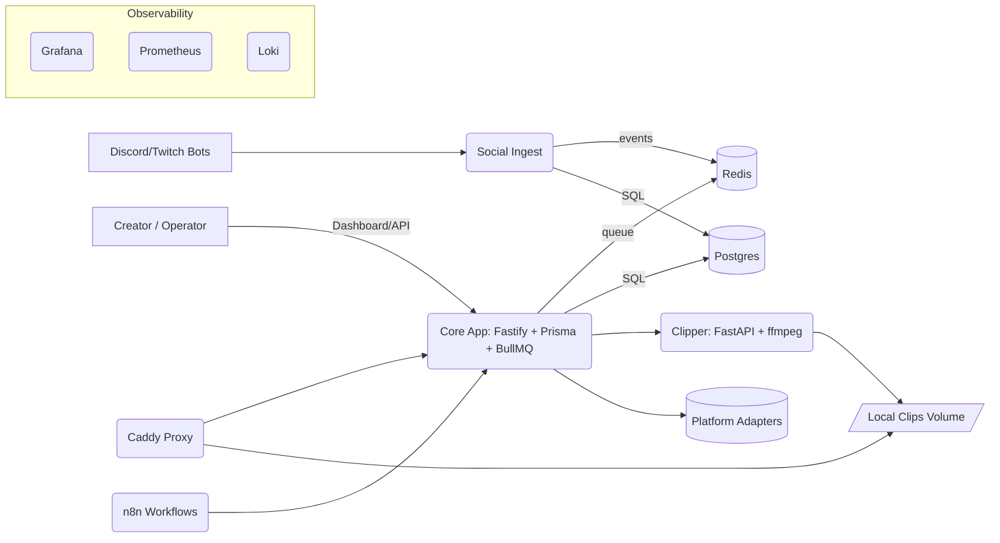
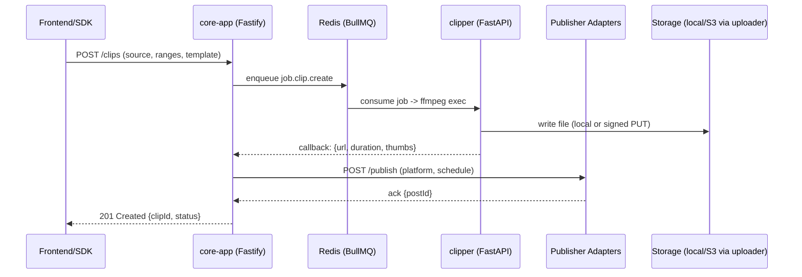

# WaveStack — Technical Architecture

> Version: v0.1 (developer preview)  
> Scope: Local/dev deployment using Docker Compose; Kubernetes notes included for future scale.

## 1) System Overview

WaveStack is a modular creator automation platform composed of a Node/TS **core-app**, a Python **clipper** (ffmpeg orchestration), optional **n8n** workflows, and future services like **social-ingest** (comments/chats), **uploader** (cloud/object storage), and a Go-based **link-router**. Services communicate primarily over HTTP+JSON and Redis (queues/streams). gRPC/Connect is planned for hot paths.

### High-level Goals

- Automate capture → clip → publish loops for streamers/creators.
- Provide interactive Discord/Twitch bots with moderation/NSFW filters.
- Learn from audience signals (ingested chats/comments) to propose engaging content.

---

## 2) Context & Containers (C4-Style)



**Core responsibilities**

- **core-app**: projects/assets, scheduling, publication adapters, analytics pullers, queues, auth.
- **clipper**: CPU-heavy media ops; returns clip metadata + public URL.
- **social-ingest** (future): normalize chats/comments → Postgres (history) + Redis Streams (real-time).
- **discord-bot / twitch-bot** (future): thin gateways that call social-ingest.
- **uploader** (future): signed-URL & streaming to S3/GDrive/OneDrive, with local temp cleanup.
- **link-router** (future, Go): fast redirects + UTM tracking + open-graph.

---

## 3) Data Flows

### 3.1 Clip request → publish



### 3.2 Social ingest → Agent insights

```mermaid
sequenceDiagram
  participant BOT as Discord/Twitch Bots
  participant ING as social-ingest
  participant R as Redis Streams
  participant AG as Agent (analysis)
  participant CORE as core-app

  BOT->>ING: POST /v1/ingest/* (normalized message)
  ING->>ING: upsert channel/auth; store message (Postgres)
  ING->>R: XADD social:messages {json}
  AG->>R: XREAD social:messages
  AG->>CORE: POST /trends/insights (topics, sentiment, Q&A)
```

---

## 4) Services (Current & Planned)

### 4.1 core-app (Node/TS)

- **HTTP**: Fastify 5, JSON APIs.
- **DB**: Postgres via Prisma.
- **Queues**: BullMQ on Redis.
- **Modules**: `cms`, `queue`, `publisher`, `trends`, `analytics`.
- **Workers**: publish, analytics-pull.
- **Config**: `.env` (Compose), later ConfigMaps/Secrets (K8s).

**Key Endpoints (example)**

- `GET /health` → 200
- `POST /clips` → create job
- `POST /publish` → publish to platform
- `GET /projects/:id/analytics` → aggregates

### 4.2 clipper (Python/FastAPI)

- Executes ffmpeg; CPU-bound.
- Saves to shared `clips` volume or via uploader service.
- `GET /health`, `POST /clip`, static `/files/*` when local.

### 4.3 social-ingest (Node/TS) — planned

- Adapters: Discord, Twitch, YouTube, Twitter/X.
- **Normalization** to canonical `MessageEvent` & `ReactionEvent`.
- **Persistence** to Postgres; **fan-out** via Redis Streams (`social:messages`).
- APIs: `GET /v1/messages`, `GET /v1/channels`, `POST /v1/ingest/discord`, `GET /v1/stream/messages` (SSE/WS).

### 4.4 uploader (Go) — planned

- Signed URL issuance (S3/R2/GCS/Azure) + streaming upload proxy.
- Webhooks → core-app on completion.
- Garbage-collect temp files; lifecycle policies.

### 4.5 link-router (Go) — planned

- /r/:code redirects with UTM; tracking pixel `/t`.
- Writes events to Redis/NATS; optional edge cache headers.

### 4.6 discord-bot / twitch-bot — planned

- Minimal logic; forwards events to social-ingest; can send replies from agent/core.

---

## 5) Contracts & Schemas

### 5.1 Shared Types (packages/shared-types)

```ts
export type Platform = 'discord'|'twitch'|'youtube'|'twitter';
export interface MessageEvent {
  id: string; platform: Platform;
  channel: { id: string; name?: string };
  author: { id: string; name: string; role?: string; isMod?: boolean };
  text: string; html?: string; ts: string; replyTo?: string;
  meta?: Record<string, any>;
}
```

### 5.2 DB (Prisma excerpts)

```prisma
model Project { id String @id @default(cuid()); name String; createdAt DateTime @default(now()) }
model Asset   { id String @id @default(cuid()); projectId String; url String; kind String; createdAt DateTime @default(now()) }
model Job     { id String @id @default(cuid()); type String; status String; payload Json; createdAt DateTime @default(now()) }
```

### 5.3 Redis Streams

- `job:clip.create` → clipper input payloads
- `social:messages` → normalized chat/comment events
- `agent:actions` → proposed replies, clips, posts

---

## 6) Communication Patterns

- **Synchronous**: HTTP+JSON between services (Fastify/FastAPI/Go net/http).
- **Asynchronous**: Redis Streams + BullMQ queues.  
- **Future**: gRPC/Connect for low-latency internals; Buf-based IDL in `idl/`.

**Proto sketch (future)**

```proto
syntax = "proto3";
package storage.v1;
message CreateSignedUrlRequest { string filename=1; string mime_type=2; string bucket=3; }
message CreateSignedUrlResponse { string upload_url=1; string public_url=2; string expires_at=3; }
service Uploader { rpc CreateSignedUrl(CreateSignedUrlRequest) returns (CreateSignedUrlResponse); }
```

---

## 7) Deployment & Environments

### 7.1 Docker Compose (dev)

- Profiles: `base`, `media`, `proxy`, `ops`.
- Strict **internal vs external** ports via env (`*_PORT_INTERNAL`).
- Volumes: `pg`, `clips`.

### 7.2 Kubernetes (later)

- Each service → Deployment + Service (ClusterIP).  
- Env via ConfigMap/Secret; horizontal autoscaling (HPA).  
- Ingress (nginx/traefik/caddy).  
- Internal DNS: `http://clipper.media.svc.cluster.local:8080`.

---

## 8) Observability & Ops

- **Metrics**: Prometheus (Fastify/Go/Python exporters).  
- **Logs**: Loki (JSON), Grafana dashboards.  
- **Tracing**: OpenTelemetry (optional), Jaeger/Tempo.
- **Health**: `/health` endpoints + Compose/K8s probes.
- **Backups**: Postgres dumps; object storage versioning.

---

## 9) Security & Compliance

- Centralized authentication via Core issuing JWTs (RS256).  
- Gateway validates JWT using JWKS, enforcing `aud`, `iss`, `exp`, `nbf`.  
- Gateway injects headers to services: `X-User-Id` (from `sub`), `X-Scopes` (from token scopes).  
- Rate limiting at gateway (per-IP 100/min; tune per env).  
- Minimal WAF guards at gateway; prefer dedicated WAF for production.  
- East-west trust via mTLS or service mesh (Istio/Linkerd) with optional OPA sidecars for policy (e.g., only Core can call Clipper `POST /clip`).  
- Internal service auth via `INTERNAL_TOKEN` headers (short-lived; rotate).  
- Secrets via Vault/SOPS/SealedSecrets; avoid raw secrets in `.env`.  
- Keys rotate using JWKS; tokens short-lived; use refresh tokens or a denylist at the gateway for revocation.  
- OAuth tokens stored encrypted (KMS/age).  
- Least privilege cloud creds; rotated keys.  
- PII minimization; request redaction; audit logs for write paths.

---

## 10) Testing Strategy

- **Unit**: Jest/Vitest for TS; pytest for Python; Go test for Go services.
- **Contract**: zod schemas; supertest; future protobuf conformance.
- **Integration**: dockerized Postgres/Redis; ephemeral DB per test run.
- **Smoke**: `docker compose up` + curl `/health` (Make target).

---

## 11) Repo Structure (recap)

```
wave/
├─ apps/
│  ├─ core-app/                 # Fastify + Prisma + BullMQ
│  ├─ discord-bot/              # discord.js; forwards to social-ingest
│  └─ n8n/
├─ services/
│  ├─ clipper/                  # FastAPI + ffmpeg
│  ├─ social-ingest/            # (planned) adapters + streams
│  ├─ uploader/                 # (planned) Go signed URLs
│  └─ link-router/              # (planned) Go redirects
├─ packages/
│  ├─ shared-types/             # zod/ts models
│  ├─ sdk-js/                   # typed REST client
│  └─ infra-scripts/            # migrate/health
└─ infra/
   ├─ compose.yaml              # dev stack
   ├─ Caddyfile                 # proxy (optional)
   └─ k8s/                      # future manifests
```

---

## 12) Risks & Mitigations

- **Rate limits / API changes** → abstraction in social-ingest adapters; backoff + circuit breakers.
- **Media CPU spikes** → queue throttling, separate worker pools, node affinity in K8s.
- **Data growth** → partition tables, S3 offload, clip TTL + sweeper jobs.
- **Secret sprawl** → central secret manager; CI masked vars; read-only roles.

---

## 13) Roadmap (engineering)

1. Solidify core-app + clipper path (done for dev).  
2. Add social-ingest (Discord first) + agent consumer.  
3. Introduce uploader (Go) + S3/R2; flip clipper to signed-URL mode.  
4. Publish adapters (YouTube/TikTok/Shorts) + link-router.  
5. Optional: migrate hot paths to gRPC; add NATS; move to K8s.

---

## 14) Appendix: Sequence — Discord → Ingest → Agent Reply

```mermaid
sequenceDiagram
  participant D as Discord Bot
  participant I as social-ingest
  participant R as Redis Streams
  participant A as Agent
  participant C as core-app

  D->>I: /v1/ingest/discord {message}
  I->>I: upsert channel/auth; store message
  I->>R: XADD social:messages
  A->>R: XREAD social:messages
  A->>C: POST /publisher/reply {channel, draft}
  C-->>D: webhook/callback to send message
```
